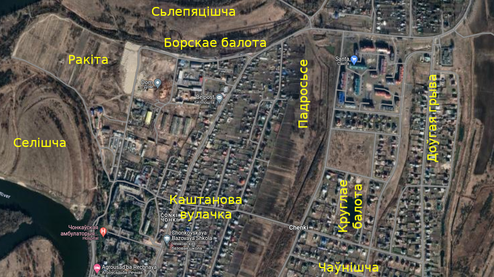
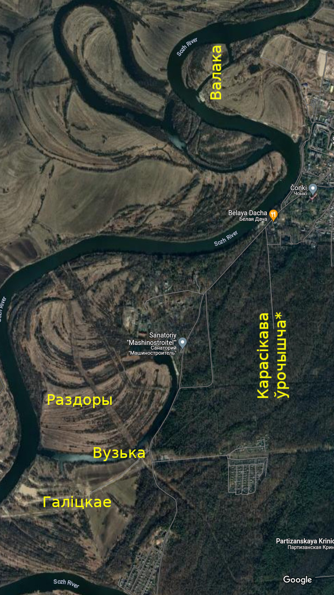

# Мясьціны

Некалі я дадаваў усе назвы, якія даведаўся ў сваёй бабулі, на wikimapia.org ды maps.google.com. Але спачатку google закрылі праект калектыўнай працы з мапамі, а потым некія вандалы павыдалялі амаль усё, што я дадаў, і засталіся толькі «Круглае балота», «Восаў» ды «Доўгая грыва». Добра, што на wikimapia.org можна паглядзець выдаленыя аб’екты, гэтак я здолеў аднавіць усе назвы, бо спачатная папяровая вэрсія ды здымак экрана былі страчаныя.

## Месцы й тлумачэньні

## Чонкі й Сеўрукі

- Падзярача&nbsp;&mdash; поле, абмежаванае гомельскай аб’язной дарогай і дарогай на Чонкі. Назва паходзіць ад аднайменнай рэчкі, якая ў часы савецкай мэліярацыі была спрамленая й цяперака выгладае як канава, якая перасякае дарогу на Чонкі каля прырынку «Хутар».
- Восаў&nbsp;&mdash; могілкі на поўдзень ад Падзярачы.
- Доўгая грыва&nbsp;&mdash; поле на поўдзень ад Сеўрукоў, на захад ад былога калгаснага сада. У паўночнай частцы сёньня знаходзіцца каналізацыйная станцыя.
- Перакавыя&nbsp;&mdash; колішняе поле на захад ад Сеўрукоў, там дзе цяперака вуліцы з арыгінальнымі назвамі 1, 2 й 3-я Палявыя. Як казала бабуля: «бо там рады́ былі ўзараныя ўпоперак».
- Прагон&nbsp;&mdash; Савецкі завулак.
- Дубраўка&nbsp;&mdash; луг між Палянай і Сеўрукамі ў раёне Прагона, з поўначы абмежаваны дарогай.

    

- Круглае балота&nbsp;&mdash; на поўдзень ад былога калгаснага сада, сёньня тут былы кар’ер.
- Чаўнішча&nbsp;&mdash; поле на поўдзень ад Круглага балота.
- Падросьсе&nbsp;&mdash; луг абмежаваны з усходу канавай, што праходзіць на ўсход ад былога калгаснага сада, з захаду&nbsp;&mdash; невялікім полем (цяпер там агароды) на захад ад вул. Піянэрскай, з поўначы&nbsp;&mdash; аўтадарогай. У заходняй частцы падзабалочаная лагчына, якую так і называлі&nbsp;&mdash; Лагчына.
- Борскае балота&nbsp;&mdash; колішняе балота на поўнач ад Чонак, адразу за аўтадарогай, там дзе цяпер канава.
- Сьлепяцішча&nbsp;&mdash; луг між Борскім балотам, Палянай і Сажом.
- Ракіта&nbsp;&mdash; колішняе поле на захад ад калгасу. Цяпер тут будуюць каменнае гета «Чонкі-2».
- Селішча&nbsp;&mdash; луг між Валакой (гл. ніжэй), Ракітай і вёскай. Некалі там быў пагорак, вядомы як «Селікава гара», зьнішчаны ў савецкі час. Хто такі «Селік» зьвестак не засталося.
- Каштанова або Герасімава вулачка&nbsp;&mdash; кавалач сучаснай вуліцы Камсамольскай між Кастрычніцкай і Сонечнай. Назва паходзіць ад прозьвішчаў ці мянушак колішніх жыхароў: Каштановых ці Герасімавых, адпаведна.

    

- Валака&nbsp;&mdash; старое рэчышча Сожа на захад ад Ракіты.
- Вузька&nbsp;&mdash; старое рэчышча Сожа, сёньня вядомае як воз. Вузкае або «Старык».
- Раздоры&nbsp;&mdash; луг за Вузькай (на правым беразе).
- Галіцкае&nbsp;&mdash; луг на роўдзень ад Вузькі (на левым беразе).
- Карасікава ўрочышча&nbsp;&mdash; дакладнага месца ўжо ня памятаю. Недзе ў лесе на дарозе ў Галіцкае.
- Восіпава ўрочышча - ўвогуле нічога не вядома.

    

## Ваколіцы

- Сасоньнік&nbsp;&mdash; у Новай Беліцы ў раёне скрыжаваньня вуліц Зайцава й Будзёнага. Тут яшчэ хапае соснаў, што падказавае адкуль пайшла назва.
- Пяскі&nbsp;&mdash; у Новай Беліцы ў раёне скрыжаваньня вуліц Будзёнага й Севастопальскай. Тут раней была аднайменная вёска, якая недзе пасьля вайны была ўключаная ў склад горада.
